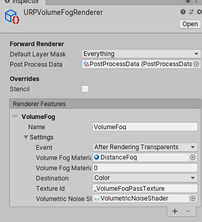

# URPFog

Simple Post Processed Raymarched Fog in Unity's Universal Render Pipeline (URP)

* Scene: 
 * Assets/Scenes/ExampleScene.unity
* Shaders:
 * Assets/URPFog/Shaders/Fog.hlsl
 * Assets/URPFog/Shaders/DistanceFog.shader
* Render Setting and Material:
 * Assets/URPFog/DistanceFo  

Note: The Render Pass Feature assignment seems to disappear occasionally. If you are not seeing fog, make sure
Assets/URPFog/DistanceFog/URPVolumeFogRenderer `RenderFeature` has a feature created from 'VolumeFog`

It is not intended as a production-ready volume fog solution, but as straightforward example of:

* Extending the ScriptableRendererFeature.
* Accessing Lights, Depth and Shadow
* Creating and Accessing 3D Textures

In the future I'd like to add:

* Dynamic compute shader generation of the 3D Noise texture based on user settings (changes to noise params, texture dimensions, etc.)
* Better (but still simple) fog implementation with artist friendly controls
* Fade to Sky color
* Optimization of the March loop, understanding how and when loops can be unrolled.
  
### This project is based on work from these other GitHub projects: 
IQ's [Fog Article](https://www.iquilezles.org/www/articles/fog/fog.htm) and Shader Toy shaders

Simple Mad's [VolumetricLights](https://github.com/SlightlyMad/VolumetricLights)

Unity's [UniversalRenderingExamples](https://github.com/Unity-Technologies/UniversalRenderingExamples)

Volumetric Textures generated with [TextureGenerator](https://github.com/mtwoodard/TextureGenerator)

